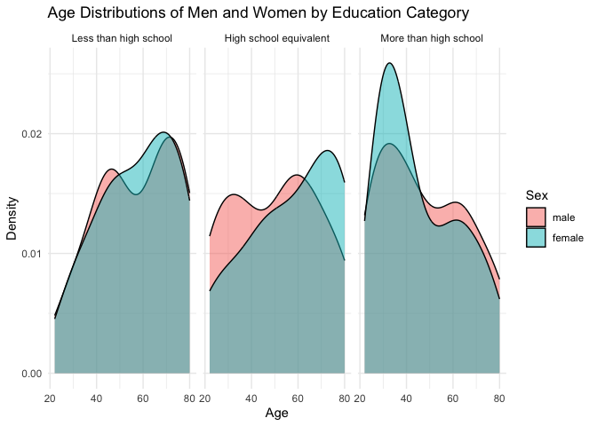
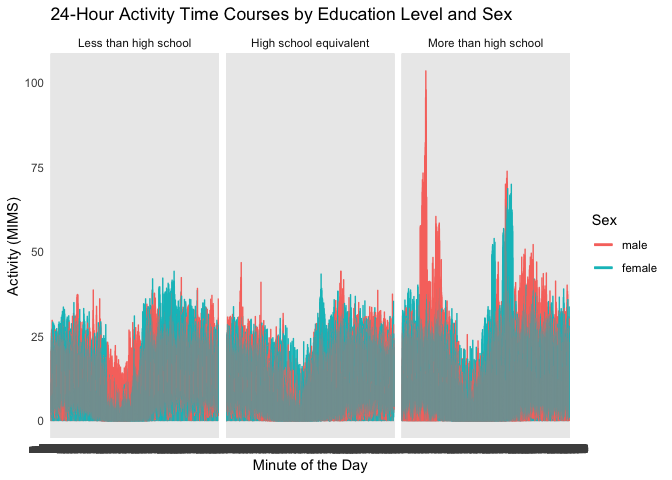
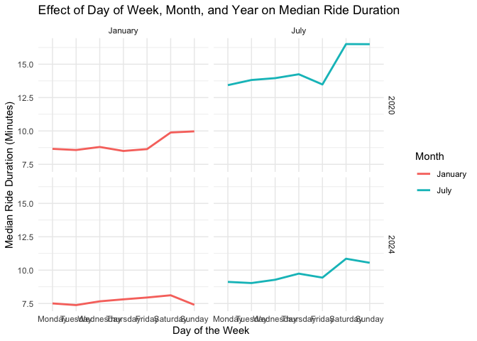
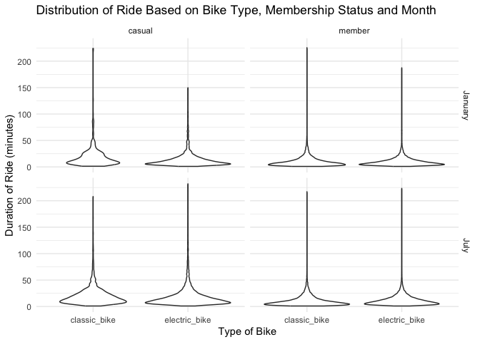

p8105_hw3_gp2770
================
Gokul Pareek
2024-10-14

I’m an R Markdown document!

# Problem 1

``` r
library(tidyverse)
```

    ## ── Attaching core tidyverse packages ──────────────────────── tidyverse 2.0.0 ──
    ## ✔ dplyr     1.1.4     ✔ readr     2.1.5
    ## ✔ forcats   1.0.0     ✔ stringr   1.5.1
    ## ✔ ggplot2   3.5.1     ✔ tibble    3.2.1
    ## ✔ lubridate 1.9.3     ✔ tidyr     1.3.1
    ## ✔ purrr     1.0.2     
    ## ── Conflicts ────────────────────────────────────────── tidyverse_conflicts() ──
    ## ✖ dplyr::filter() masks stats::filter()
    ## ✖ dplyr::lag()    masks stats::lag()
    ## ℹ Use the conflicted package (<http://conflicted.r-lib.org/>) to force all conflicts to become errors

``` r
library(ggridges)
library(patchwork)

library(p8105.datasets)
```

## Reading in the data

``` r
data("ny_noaa")
```

## Answering questions about the data

This dataset contains 2595176 rows and 7 columns. Variables include
weather station id, date of observation, (tenths of mm), snowfall (mm),
snow depth (mm), and min and max temperature (tenths of degrees C).

Below we clean the data, creating separate variables for year, month,
and day and converting `tmax` and `tmin` to numeric. We find that 0 is
the most commonly observed value for snowfall. This is because most days
of the year, it does not snow at all in NY. The second most commonly
observed value is `NA`, indicating missingness. Other common values are
13, 25, and 51, suggesting that snowfall is originally recorded in
fractions of an inch and converted to mm.

``` r
ny_noaa %>% 
  count(snow) %>%
  arrange(desc(n))
```

    ## # A tibble: 282 × 2
    ##     snow       n
    ##    <int>   <int>
    ##  1     0 2008508
    ##  2    NA  381221
    ##  3    25   31022
    ##  4    13   23095
    ##  5    51   18274
    ##  6    76   10173
    ##  7     8    9962
    ##  8     5    9748
    ##  9    38    9197
    ## 10     3    8790
    ## # ℹ 272 more rows

``` r
ny_noaa = 
  ny_noaa %>% 
  separate(date, into = c("year", "month", "day"), convert = TRUE) %>% 
  mutate(
    tmax = as.numeric(tmax),
    tmin = as.numeric(tmin))
```

Below is a two-panel plot showing the average max temperature in January
and in July in each station across years. As expected, the mean
temperature in January is much lower than the mean temperature in July
for all stations and across all years. All stations appear to follow
similar trends of temperature peaks and valleys within a month across
the years, i.e. when one station has a high monthly mean temperature for
a given year, most other stations also have a high monthly mean
temperature for that year. We do see one uncharacteristically cold
station in July of 1987 or 1988, as well as a few other less drastic
outliers.

``` r
ny_noaa %>% 
  group_by(id, year, month) %>% 
  filter(month %in% c(1, 7)) %>% 
  summarize(mean_tmax = mean(tmax, na.rm = TRUE, color = id)) %>% 
  ggplot(aes(x = year, y = mean_tmax, group = id)) + geom_point() + geom_path() +
  facet_grid(~month) +
  labs(title = "Mean monthly temperature for each station across years for January and July")
```

    ## `summarise()` has grouped output by 'id', 'year'. You can override using the
    ## `.groups` argument.

    ## Warning: Removed 5970 rows containing missing values or values outside the scale range
    ## (`geom_point()`).

    ## Warning: Removed 5931 rows containing missing values or values outside the scale range
    ## (`geom_path()`).

<!-- -->

Below we show a two-panel plot including (i) a hex plot of `tmax` vs
`tmin` for the full dataset; and (ii) a ridge plot showing the
distribution of snowfall values (in mm) greater than 0 and less than 100
separately by year.

From the hex plot we see that while there is some variability, the
majority of the data cluster tightly in the center of the distribution.
In relatively rare cases, it seems that `tmax` is less than `tmin`,
which raises questions about data recording and quality.

From the ridge plot, we see a multimodal density of snowfall within a
given year. Most stations see between 0 and 35 mm of snow in a year.
Then there is a another group of stations that see about 45 mm of snow,
and another group that sees nearly 80 mm. It is likely this
multimodality stems from the conversion of measurements in one system
(fractions of an inch) to another (using the metric system), which was
also noted in the table of common values.

``` r
hex = 
  ny_noaa %>% 
  ggplot(aes(x = tmin, y = tmax)) + 
  geom_hex()

ridge = 
  ny_noaa %>% 
  filter(snow < 100, snow > 0) %>%
  ggplot(aes(x = snow, y = as.factor(year))) + 
  geom_density_ridges()

hex + ridge
```

    ## Warning: Removed 1136276 rows containing non-finite outside the scale range
    ## (`stat_binhex()`).

    ## Picking joint bandwidth of 3.76

<!-- -->

# Problem 2

## Loading and cleaning the accelerometer data.

``` r
accel_df <- read_csv("data/nhanes_accel.csv") %>% 
  janitor::clean_names()
```

    ## Rows: 250 Columns: 1441
    ## ── Column specification ────────────────────────────────────────────────────────
    ## Delimiter: ","
    ## dbl (1441): SEQN, min1, min2, min3, min4, min5, min6, min7, min8, min9, min1...
    ## 
    ## ℹ Use `spec()` to retrieve the full column specification for this data.
    ## ℹ Specify the column types or set `show_col_types = FALSE` to quiet this message.

## Loading, cleaning and tidying the demographic data.

Data is encoded with reasonable variable classes.

``` r
demographic_df <- read_csv("data/nhanes_covar.csv", skip = 4) %>% 
  janitor::clean_names() %>% 
  mutate(
    sex = recode(sex, 
                 "1" = "male", 
                 "2" = "female"),
    sex = factor(sex, levels = c("male", "female")),
    education = recode(education,
                       "1" = "Less than high school",
                       "2" = "High school equivalent",
                       "3" = "More than high school"),
    education = factor(education, levels = c("Less than high school", "High school equivalent", "More than high school"))
  )
```

    ## Rows: 250 Columns: 5
    ## ── Column specification ────────────────────────────────────────────────────────
    ## Delimiter: ","
    ## dbl (5): SEQN, sex, age, BMI, education
    ## 
    ## ℹ Use `spec()` to retrieve the full column specification for this data.
    ## ℹ Specify the column types or set `show_col_types = FALSE` to quiet this message.

## Merging the two datasets and excluding participants less than 21 years of age and those with missing demographic data.

``` r
nhanes_df <- left_join(demographic_df, accel_df, by = "seqn") %>% 
  filter(age > 21) %>% 
  drop_na(education, bmi, age, sex)
```

## A reader-friendly table for the number of men and women in each education category.

``` r
nhanes_df %>% 
  group_by(education, sex) %>% 
  summarize(
    count = n()
  ) %>% 
  pivot_wider(
    names_from = sex,
    values_from = count
  ) %>% 
  rename(Men = male, Women = female) %>% 
  knitr::kable(
    caption = "Number of men and women in each education category"
  ) 
```

    ## `summarise()` has grouped output by 'education'. You can override using the
    ## `.groups` argument.

| education              | Men | Women |
|:-----------------------|----:|------:|
| Less than high school  |  27 |    28 |
| High school equivalent |  34 |    23 |
| More than high school  |  54 |    59 |

Number of men and women in each education category

The table highlights the distribution of men and women across different
education categories. In the “Less than High School” category, there is
near parity, with 27 men and 28 women, indicating similar levels of
educational attainment at this level. However, for the “High School
Equivalent” category, men (34) slightly outnumber women (23), suggesting
that more men have achieved this level of education. In contrast, in the
“More than High School” category, women (59) surpass men (54).

## Visualization of the age distributions for men and women in each education category.

``` r
ggplot(nhanes_df, aes(x = age, fill = sex)) +
  geom_density(alpha = 0.5) +  
  facet_wrap(~ education) +  
  labs(
    title = "Age Distributions of Men and Women by Education Category",
    x = "Age",
    y = "Density",
    fill = "Sex"
  ) +
  theme_minimal()
```

<!-- -->

Overall, the graph indicates that older participants tend to have less
than a high school education, while younger and middle-aged individuals
are more evenly distributed across the higher education categories.
Women are more prevalent in the “More than high school” category, which
aligns with the trend observed in the earlier table where more women
than men had higher educational attainment.

## Creating a total activity variable for each participant.

``` r
total_activity_df <- nhanes_df %>%
  group_by(seqn, age, sex, education) %>%
  summarise(total_activity = rowSums(across(min1:min1440), na.rm = TRUE), .groups = 'drop')
```

## Plotting total activities against age; comparing men to women and having separate panels for each education level.

``` r
ggplot(total_activity_df, aes(x = age, y = total_activity, color = sex)) +
  geom_point(alpha = 0.5) +  
  geom_smooth(se = FALSE) +  
  facet_wrap(~ education) +  
  labs(
    title = "Total Daily Activity vs Age by Gender and Education Level",
    x = "Age (years)",
    y = "Total Activity (MIMS)",
    color = "Gender"
  ) +
  theme_minimal()
```

    ## `geom_smooth()` using method = 'loess' and formula = 'y ~ x'

<!-- -->

The plot shows total daily activity (measured in MIMS) versus age, split
by education level and gender. Across all education categories, there is
a general decline in activity with age, but the patterns vary by gender
and education. Men and women with “Less than high school” education
display a steep decline in activity around middle age, particularly for
men. In the “High school equivalent” category, the total activity
fluctuates more, especially for females, who exhibit a peak around
middle age. In the “More than high school” group, both men and women
show a more gradual decline in activity.

## A three-panel plot showing 24-hour activity time courses for each education level.

``` r
nhanes_df %>%
  select(seqn, education, sex, starts_with("min")) %>%
  pivot_longer(cols = starts_with("min"), 
               names_to = "minute", 
               values_to = "activity") %>%
  ggplot(aes(x = minute, y = activity, color = sex)) +
  geom_line() +
  geom_smooth(se = FALSE) +
  facet_wrap(~ education) + 
  labs(
    title = "24-Hour Activity Time Courses by Education Level and Sex",
    x = "Minute of the Day",
    y = "Activity (MIMS)",
    color = "Sex"
  ) +
  theme_minimal()
```

    ## `geom_smooth()` using method = 'loess' and formula = 'y ~ x'

<!-- -->
The 24-hour activity time courses by education level and sex reveal
clear patterns in physical activity. Men consistently exhibit higher
activity levels throughout the day compared to women, with notable peaks
in the morning and early evening across all education categories.
Participants with more than a high school education demonstrate the
highest overall activity, suggesting that higher educational attainment
correlates with increased daily physical activity. The smoothed trends
indicate that while both sexes experience similar fluctuations, mens’
activity levels are generally more pronounced, particularly during peak
times.

# Problem 3

## Importing, cleaning, and tidying the given datasets.

``` r
january_2020_df = 
  read_csv("data/Jan 2020 Citi.csv") %>% 
  janitor::clean_names() %>% 
  mutate(
    month = "January",
    year = "2020"
  )
```

    ## Rows: 12420 Columns: 7
    ## ── Column specification ────────────────────────────────────────────────────────
    ## Delimiter: ","
    ## chr (6): ride_id, rideable_type, weekdays, start_station_name, end_station_n...
    ## dbl (1): duration
    ## 
    ## ℹ Use `spec()` to retrieve the full column specification for this data.
    ## ℹ Specify the column types or set `show_col_types = FALSE` to quiet this message.

``` r
january_2024_df = 
  read_csv("data/Jan 2024 Citi.csv") %>% 
  janitor::clean_names() %>% 
   mutate(
    month = "January",
    year = "2024"
  )
```

    ## Rows: 18861 Columns: 7
    ## ── Column specification ────────────────────────────────────────────────────────
    ## Delimiter: ","
    ## chr (6): ride_id, rideable_type, weekdays, start_station_name, end_station_n...
    ## dbl (1): duration
    ## 
    ## ℹ Use `spec()` to retrieve the full column specification for this data.
    ## ℹ Specify the column types or set `show_col_types = FALSE` to quiet this message.

``` r
july_2020_df = 
  read_csv("data/July 2020 Citi.csv") %>% 
  janitor::clean_names() %>% 
   mutate(
    month = "July",
    year = "2020"
  )
```

    ## Rows: 21048 Columns: 7
    ## ── Column specification ────────────────────────────────────────────────────────
    ## Delimiter: ","
    ## chr (6): ride_id, rideable_type, weekdays, start_station_name, end_station_n...
    ## dbl (1): duration
    ## 
    ## ℹ Use `spec()` to retrieve the full column specification for this data.
    ## ℹ Specify the column types or set `show_col_types = FALSE` to quiet this message.

``` r
july_2024_df = 
  read_csv("data/July 2024 Citi.csv") %>% 
  janitor::clean_names() %>% 
   mutate(
    month = "July",
    year = "2024"
  )
```

    ## Rows: 47156 Columns: 7
    ## ── Column specification ────────────────────────────────────────────────────────
    ## Delimiter: ","
    ## chr (6): ride_id, rideable_type, weekdays, start_station_name, end_station_n...
    ## dbl (1): duration
    ## 
    ## ℹ Use `spec()` to retrieve the full column specification for this data.
    ## ℹ Specify the column types or set `show_col_types = FALSE` to quiet this message.

## Combining the four datasets.

``` r
citi_df = 
  bind_rows(january_2020_df, january_2024_df, july_2020_df, july_2024_df)
```

The resulting dataset combines the 1% of all rides with a total duration
less than 4 hours in each of the following four months: January 2020,
January 2024, July 2020 and July 2024. There are 9 variables and 99485
observations in the final dataset. The variables include ride ids, the
type of ride, specific day of the week when it was rented, the duration
of the ride in minutes, the start and the end station, classification of
the rider (member/casual) and the month and year.

## A reader-friendly table showing the total number of rides in each combination of year and month separating casual riders and Citi Bike members.

``` r
citi_df %>% 
  group_by(month, year, member_casual) %>% 
  summarize(
    total_rides = n()
  ) %>% 
  pivot_wider(
    names_from = member_casual,
    values_from = total_rides
  ) %>% 
  knitr::kable()
```

    ## `summarise()` has grouped output by 'month', 'year'. You can override using the
    ## `.groups` argument.

| month   | year | casual | member |
|:--------|:-----|-------:|-------:|
| January | 2020 |    984 |  11436 |
| January | 2024 |   2108 |  16753 |
| July    | 2020 |   5637 |  15411 |
| July    | 2024 |  10894 |  36262 |

The number of rides, for both casual riders and members, increased from
2020 to 2024. In both years, July had considerably more rides compared
to January, reflecting seasonal variation in ride frequency (e.g., more
rides in summer months). Citi Bike members consistently logged more
rides than casual riders in all periods.

## A table showing the 5 most popular starting stations for July 2024; including the number of rides originating from these stations.

``` r
popular_stations <- citi_df %>%
  filter(month == "July", year == 2024) %>%  
  group_by(start_station_name) %>%              
  summarize(total_rides = n()) %>%          
  arrange(desc(total_rides)) %>% 
  head(5)
```

## A plot to investigate the effects of day of the week, month, and year on median ride duration.

``` r
ride_duration_summary <- citi_df %>%
  group_by(weekdays, month, year) %>%            
  summarise(median_duration = median(duration, na.rm = TRUE)) %>% 
  mutate(
    weekdays = factor(weekdays, levels = c("Monday", "Tuesday", "Wednesday",     "Thursday", "Friday", "Saturday", "Sunday"))) %>% 
  ungroup()
```

    ## `summarise()` has grouped output by 'weekdays', 'month'. You can override using
    ## the `.groups` argument.

``` r
ggplot(ride_duration_summary, aes(x = weekdays, y = median_duration, color = month)) +
  geom_line(aes(group = month), size = 1) +        
  facet_grid(year ~ month) +         
  labs(
    title = "Effect of Day of Week, Month, and Year on Median Ride Duration",
    x = "Day of the Week",
    y = "Median Ride Duration (Minutes)",
    color = "Month",
  ) +
  theme_minimal()
```

    ## Warning: Using `size` aesthetic for lines was deprecated in ggplot2 3.4.0.
    ## ℹ Please use `linewidth` instead.
    ## This warning is displayed once every 8 hours.
    ## Call `lifecycle::last_lifecycle_warnings()` to see where this warning was
    ## generated.

<!-- -->

The plot reveals significant trends in bike rental usage across
different days of the week, months, and years. Typically, median ride
durations are longer on weekends, indicating that casual riders likely
use bikes for recreational purposes, while weekday rides may reflect
shorter commutes. The separation of data by year allows for a
comparative analysis, highlighting shifts in user behavior, such as
increased ride durations in 2024 compared to 2020, which could indicate
a growing popularity of bike-sharing. The color coding for months aids
in identifying consistent patterns, prompting further exploration into
factors influencing these trends.

## Impact of month, membership status, and bike type on the distribution of ride duration (2024 Data)

``` r
citi_2024_summary <- citi_df %>%
  filter(year == 2024) %>%  
  mutate(month = factor(month, levels = month.name))

ggplot(citi_2024_summary, aes(x = rideable_type, y = duration)) +
  geom_violin() + 
  facet_grid(month ~ member_casual) +
  labs(
    title = "Distribution of Ride Based on Bike Type, Membership Status and Month",
    x = "Type of Bike",
    y = "Duration of Ride (minutes)"
  ) +
  theme_minimal()
```

<!-- -->

The plot depicting the distribution of ride duration by month,
membership status, and bike type in 2024 reveals several insightful
trends. Violin plots illustrate that electric bikes, which have become
more prevalent since 2020, tend to attract longer ride durations In
contrast, Citi Bike members generally show shorter ride durations,
indicative of their usage for commuting purposes.
